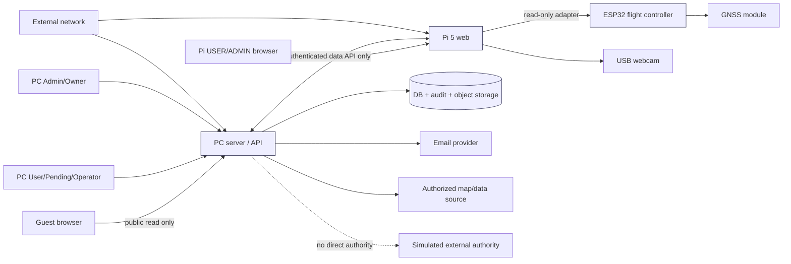
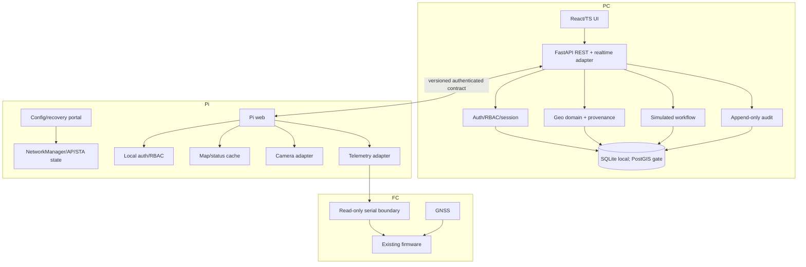
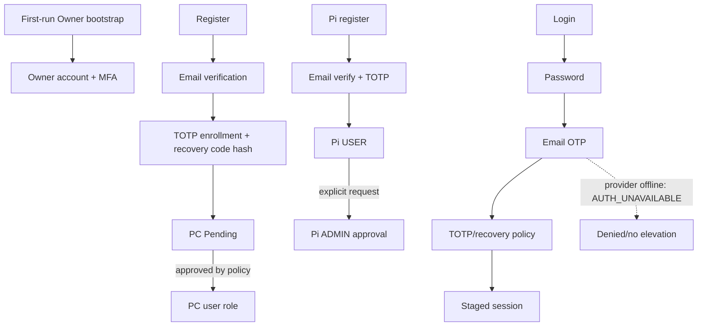
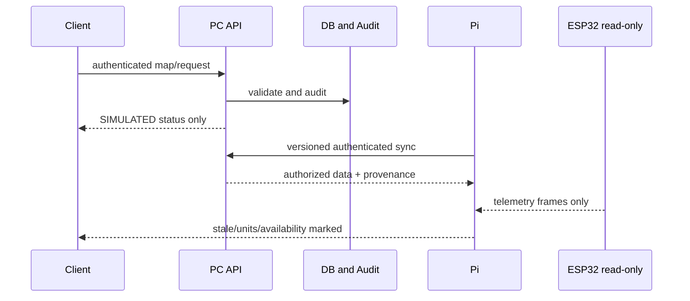

# SCOPE-00 — Kiến trúc hệ thống

## Context và trust boundaries

Trust boundaries: public browser↔PC public API; PC↔Pi authenticated integration; Pi↔USB/serial devices; application↔OS/network services; source data↔licensed content. “Simulated external authority” is a label only, not an integration endpoint.

## Module view

## Safety boundary

PC workflow output terminates at `SIMULATED` status. Pi may display telemetry and status; no API schema, route, websocket, serial adapter or UI action accepts an ARM/DISARM command. Any future firmware/flight-mode work requires SCOPE-07 and explicit safety review.

## Identity flow

Email verification is not inferred from an existing browser session. PC and Pi flows remain separate.

## Data flow and operations

Operational future sequence: boot AP/local web → start status adapters → load last-known-good cache → attempt STA → probe Internet → probe central server → expose explicit states → persist redacted logs/audit → backup by policy. Failure keeps AP/local service alive where possible; it never triggers actuator behavior.

## Offline-first behavior

| Condition | Required behavior |
|---|---|
| Internet down | AP, local Pi web, camera and cached internal data continue; show `internet_reachable=false`. |
| PC unreachable | Pi keeps local web/camera/last telemetry; show `central_server_reachable=false`; cache marked stale. |
| Email provider unavailable | No new MFA bypass; show `AUTH_UNAVAILABLE`, preserve audit-safe error. |
| GNSS no valid fix | Coordinates `UNAVAILABLE`/`STALE`; never fabricate a point. |
| Map cache old | Visible `stale_at`/age and provenance; no legal validity claim. |
