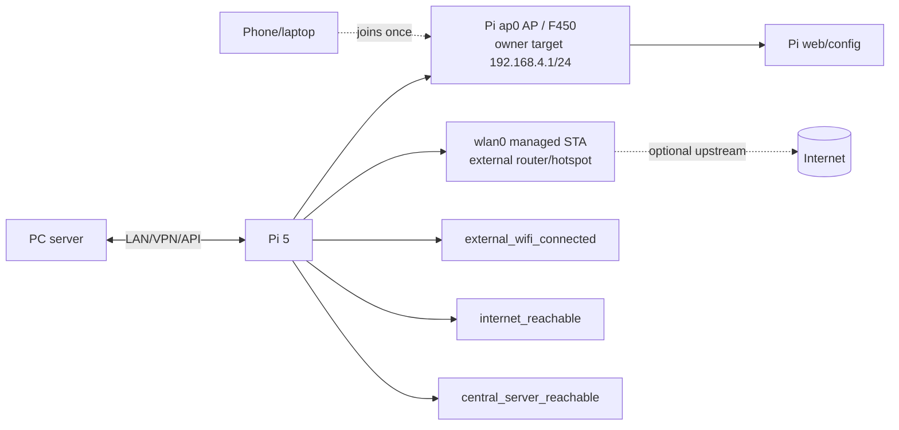

# SCOPE-00 — Network architecture

> **Current owner-directed SCOPE-03 deployment profile (2026-09-24):** the previous onboard-AP + USB-STA design remains historical evidence. The target Pi profile is one onboard PHY with managed `wlan0` for upstream STA and `ap0` for the local F450 AP, subject to live validation. This note is an architecture override, not live authorization.

## Addressing policy

The current owner target names `192.168.4.1/24` and SSID `F450`, but live overlap, DHCP range, channel, regulatory domain and service state remain to be verified. At runtime check overlap with upstream networks before treating the target as operational. Do not expose credentials or raw client identifiers in evidence.

## Reachability semantics

- `external_wifi_connected`: NetworkManager reports the verified managed STA associated and has a usable address.
- `internet_reachable`: application-level probe to an approved endpoint succeeds; DNS-only is insufficient.
- `central_server_reachable`: authenticated health/version handshake with PC succeeds.

These booleans are independent. Internet down does not imply AP/LAN down. PC down does not imply camera/Pi local service down.

## Portal and recovery

Serve config page on the `ap0` gateway with a documented manual URL. Captive portal detection varies by OS and must never be a sole access path. Configuration endpoint accepts typed SSID/profile parameters, validates length/encoding, delegates to a constrained NetworkManager adapter, and never executes arbitrary shell text. On failed STA update, keep AP up and preserve the previous known-good profile.

For the single-radio profile, managed `wlan0` and AP `ap0` must share one PHY and therefore the same channel when the hardware capability is confirmed. Runtime channel synchronization is a proposed implementation behavior, not yet live-observed in this repository.

## Segmentation

Default AP clients reach only Pi web/config and allowed local services. No admin SSH from AP by default. Upstream forwarding/NAT is disabled unless explicitly required and tested. TLS/device identity protects PC↔Pi even on a shared LAN.
