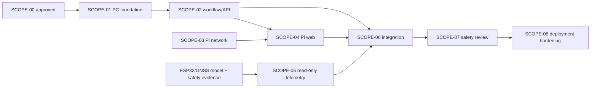

# SCOPE-00 — Scope dependencies

```mermaid
flowchart LR
  S00[SCOPE-00 approved] --> S01[SCOPE-01 PC foundation]
  S01 --> S02[SCOPE-02 workflow/API]
  S02 --> S04[SCOPE-04 Pi web]
  S03[SCOPE-03 Pi network] --> S04
  HW[ESP32/GNSS model + safety evidence] --> S05[SCOPE-05 read-only telemetry]
  S02 --> S06[SCOPE-06 integration]
  S04 --> S06
  S05 --> S06
  S06 --> S07[SCOPE-07 safety review]
  S07 --> S08[SCOPE-08 deployment hardening]
```

Each scope must stop on unmet preconditions. A mock can unblock software tests only when labeled mock; it cannot close a hardware/legal gate.
